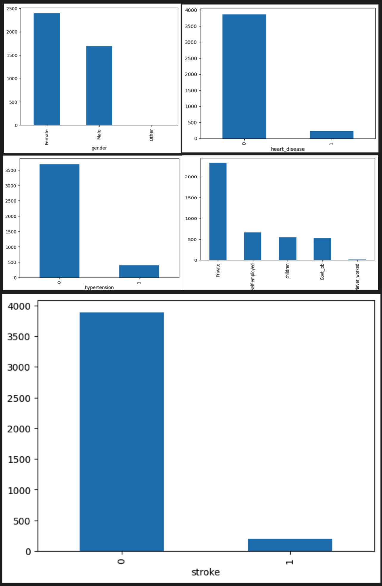
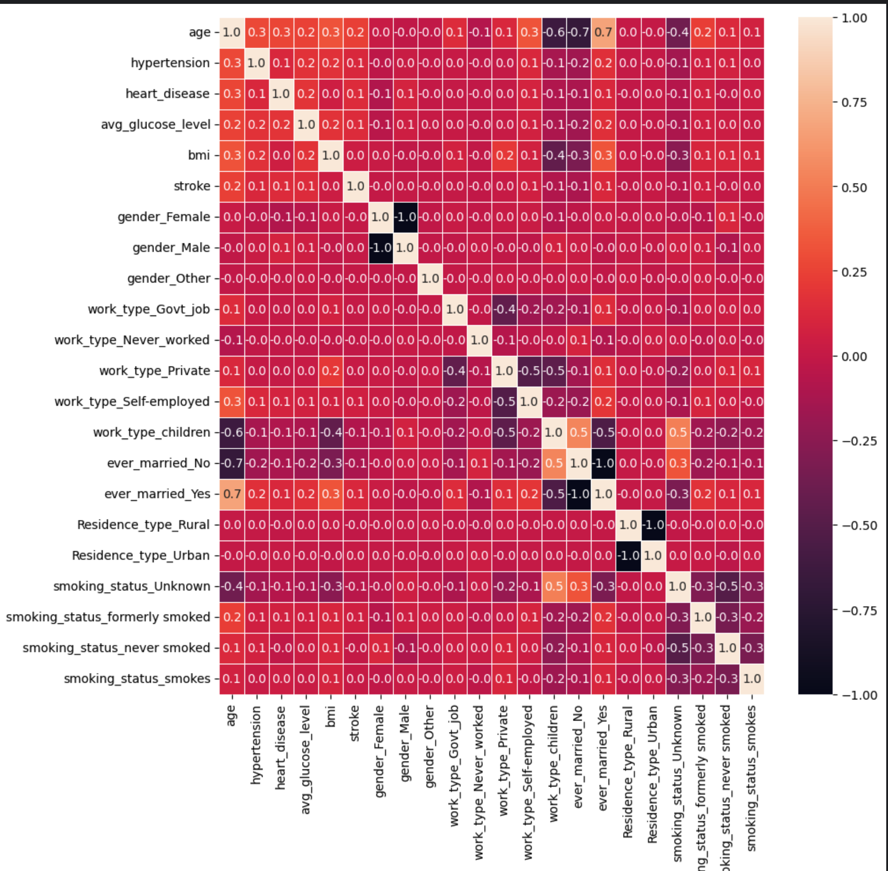
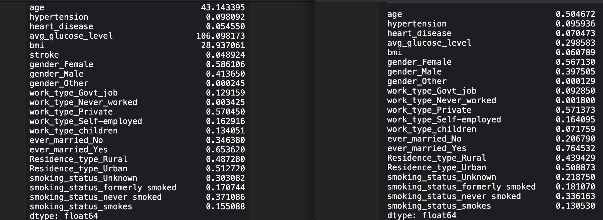
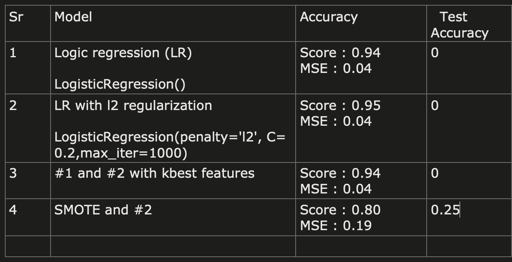

# Stroke Prediction

# Overview
This project aims to predict whether an individual will develop stroke or not based on various health indicators. 
As we have to classify the individual in either category of stroke, its a classic logistic regression problem.

## Dataset Description
--------------------------

**Data Set Characteristics:**

    :Number of Instances: 4088

    :Number of Attributes: 4 numeric + 5 categorical  predictive attributes and the numerical target

    :Attribute Information:
     #   Column             Non-Null Count  Dtype  
        ---  ------             --------------  -----  
        0   gender             4088 non-null   object 
        1   age                4088 non-null   float64
        2   hypertension       4088 non-null   int64  
        3   heart_disease      4088 non-null   int64  
        4   ever_married       4088 non-null   object 
        5   work_type          4088 non-null   object 
        6   Residence_type     4088 non-null   object 
        7   avg_glucose_level  4088 non-null   float64
        8   bmi                3926 non-null   float64
        9   smoking_status     4088 non-null   object 

    :Missing Attribute Values: bmi : 126 entries

The target variable is the stroke possibility expressed in either 1 or 0.

### Approach
1. Exlore the dataset 
3. Data preprocessing 
4. Analyze correlations
5. Train and evaluate model 

#### Explore the dataset 
Few observation after analyzing the dataset
- gender : majority of the samples are of female gender
- One sample wheer gender = other
- hypertension and heart_disease : Significant over representation of no hypertension and no heart disease 
- work_type : significant majority of the work_type as private
- ever_married : clear majority of the ever_married=true population
- bmi, age, avg_glucose_level : have to club them in bins based on range and try as data is very sparse
    based on bins,
        - majority the samples are of age>30 and
        - bmi between 25-40 and
        - avg_glucose_level between 50-100
- smoking_status : major cases fall in either never_smoked and unknown category
- stroke : The dataset only contains 5% samples that represent no stroke. This leads to the class imbalance due to under representation of stroke cases.

#### Data preprocessing 
- Handling missing and duplicate values
    - bmi was missing from many samples, replaced the missing value with mean value the bmi. 
    - checked to see if any duplicate present accross all features together : didn't find any.
- Encoding categorical features using one hot encoding
    -   The dataset has few categorical features 'gender','work_type','ever_married','Residence_type','smoking_status'. 
    -   The encoding creates several additional features with numerical values, this will be helpful of model training.   

#### Analyze correlations 
- Plotted the heatmap with seaborn library of all features 
- The goal was drop the highly corelated features but the result was inconclusive to drop any features. eg. strong correlation between age vs married_type_no, its 0.7, with this data we can add one of the column. It seemed illogical to remove age in this case, as theoratically it could be a significant contributor to the stroke. 
- Finally decided to not use result from this for now. More study needed on correlation matrix.  
- The correlation plots are in images. Interesting to note The correlation plot does not change after normalizing the data. 

#### Train and evaluate model 
- After trying with few logistic regression models, the test accuracy didn't improve, it was 0. However they performed resonably well in training with > 90% accuracy. 
- Assuming the model could be overfitting, tried applying l2 regularization to apply penalty, but that didnt showed any improvement. 
- Decided to take a look at dataset again. Upon closer inspection, found the case of class imbalance.  
- To resolve this, used the imblearn.over_sampling package. It added more data and changed the overall distribution, which is evident from the mean values below of before and after SMOTE, as shown below. 

- Test accuracy improved after this. The best accuarcy, 0.25 achieved was using SMOTE and applying logistic regression model.

#### Roadmap further 
-  The age, bmi and glucose_level, instead of using these features alone, we can group these in range/bins to study the effect on overall score.
-  Use other techniques including Recursive feature ellimination and sequential feature selection.

## Reference
- [Stroke Prediction by 123 of AI (Dec 2023)](https://kaggle.com/competitions/stroke-prediction-by-123-of-ai-dec-2023) by [Abbhinav Venkat](https://www.kaggle.com/abbhinavvenkat)